<div align="center">

# 🎟️ EventEz


### ✨ The Ultimate Platform for Nightlife, Sports & Event Booking ✨

[](https://www.eventez.vercel.app)
[](https://github.com/nishchayy07/EventEz)
[](LICENSE)

<p align="center">
  <a href="#-features">Features</a> •
  <a href="#-screenshots">Screenshots</a> •
  <a href="#-tech-stack">Tech Stack</a> •
  <a href="#-installation">Installation</a> •
  <a href="#-qr-ticket-validation">QR Validation</a>
</p>

</div>

---

## 🎯 About

**EventEz** is a modern, full-stack event booking platform that revolutionizes how you discover and book entertainment events. From electrifying **Nightlife** experiences to thrilling **Sports matches** and hilarious **Comedy shows** — EventEz delivers a seamless, intuitive booking experience.

> 💡 **What makes us different?** Real-time seat selection, secure QR-based ticket validation, and a stunning dark-mode UI that users love!

---

## ⚡ Features

<table>
<tr>
<td width="50%">

### 🎪 Event Discovery
- **Dynamic Categories** — Browse Nightlife, Sports, Comedy & Movies
- **Smart Search** — Find events with powerful filters
- **Location-Based** — Discover events near you
- **Detailed Pages** — Pricing, dates, venues & descriptions

</td>
<td width="50%">

### 🎫 Booking Experience
- **Interactive Seat Selection** — Choose your perfect spot
- **Real-time Availability** — See seats update live
- **Secure Payments** — Safe transaction handling
- **Instant Confirmation** — Get your tickets immediately

</td>
</tr>
<tr>
<td width="50%">

### 🔐 Security & Auth
- **Clerk Authentication** — Secure sign-up & login
- **QR Ticket Validation** — One-time scan tickets
- **Staff Scanner Portal** — Streamlined entry management
- **Fraud Prevention** — Tickets expire after first scan

</td>
<td width="50%">

### 🎨 User Experience
- **Dark Mode UI** — Easy on the eyes
- **Responsive Design** — Mobile, Tablet & Desktop
- **AI Chatbot** — Instant help when you need it
- **Smooth Animations** — Polished micro-interactions

</td>
</tr>
</table>

---

## 🎯 QR Ticket Validation

<div align="center">

### 🔒 One-Time Scan Security System

</div>

One of EventEz's standout features is the **intelligent QR ticket validation system**. Here's how it works:

```
┌─────────────────┐     ┌─────────────────┐     ┌─────────────────┐
│   User Books    │────▶│  QR Generated   │────▶│  Ticket Ready   │
│     Event       │     │   Instantly     │     │    for Entry    │
└─────────────────┘     └─────────────────┘     └─────────────────┘
                                                        │
                                                        ▼
┌─────────────────┐     ┌─────────────────┐     ┌─────────────────┐
│  Entry Denied   │◀────│ Marked as Used  │◀────│  Staff Scans    │
│   (If Reused)   │     │  in Database    │     │   QR Code       │
└─────────────────┘     └─────────────────┘     └─────────────────┘
```

| State | Description |
|:---:|:---|
| ✅ **Valid** | Fresh ticket, ready for entry — shows green confirmation |
| ❌ **Expired** | Already scanned once — shows red "Ticket Already Used" |
| ⚠️ **Invalid** | Fake/tampered QR — shows error message |

> 🛡️ **This prevents ticket fraud and ensures each booking is used only once!**

<div align="center">

| QR Code Generated | First Scan (Valid ✅) | Second Scan (Expired ❌) |
|:---:|:---:|:---:|
| 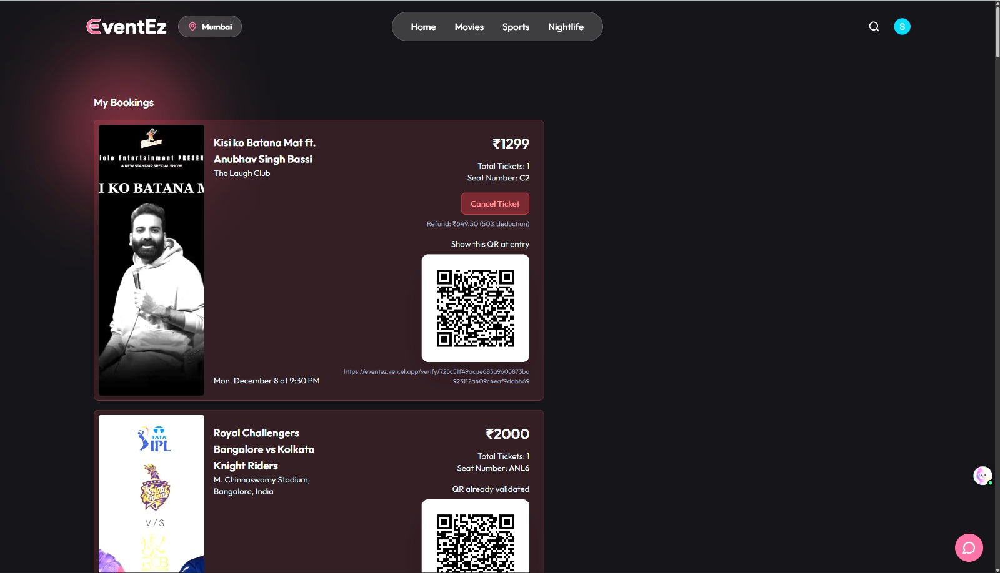 | 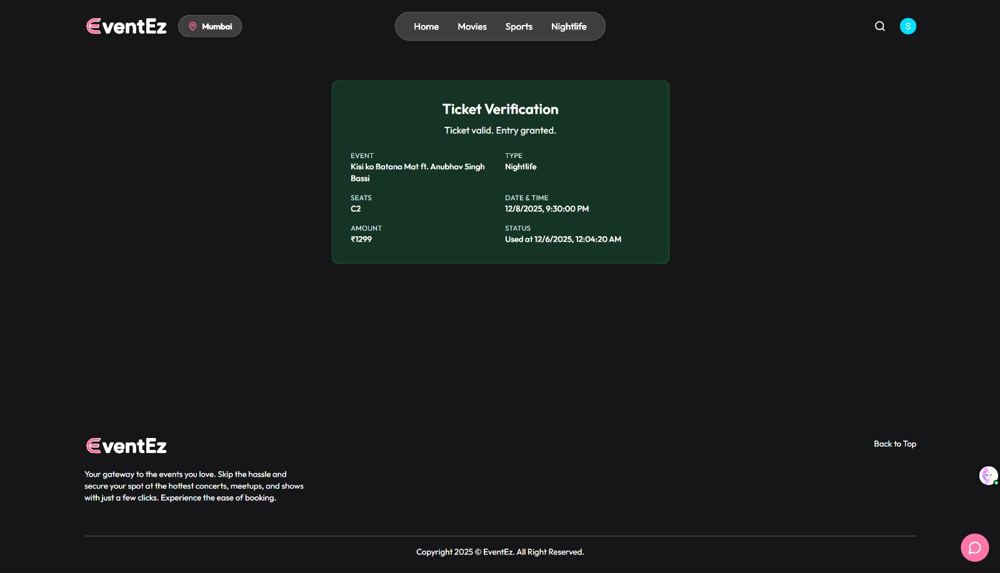 | 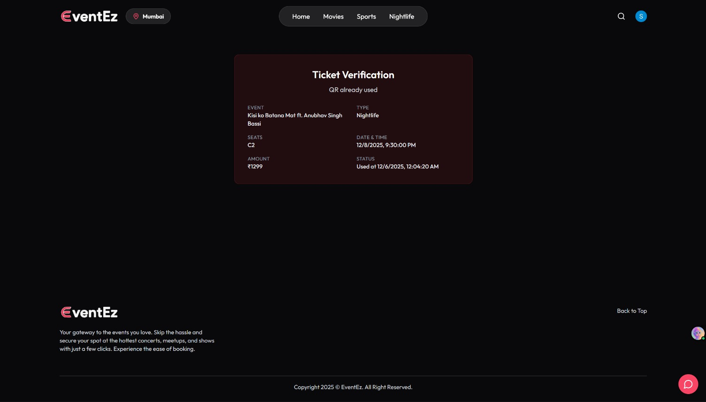 |

</div>

---

## 📸 Screenshots

<div align="center">

### 🏠 Landing Page
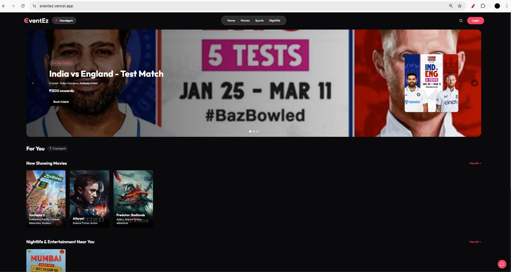

---

### 🌃 Event Categories

| Nightlife Events | Sports Events |
|:---:|:---:|
| 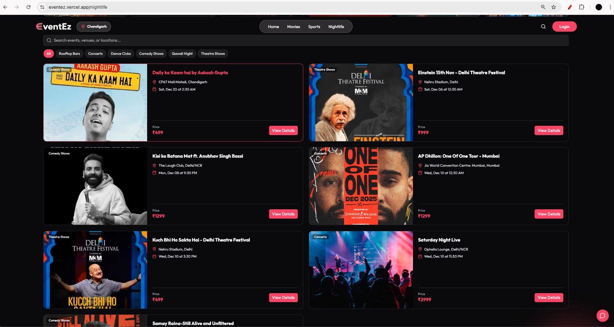 | 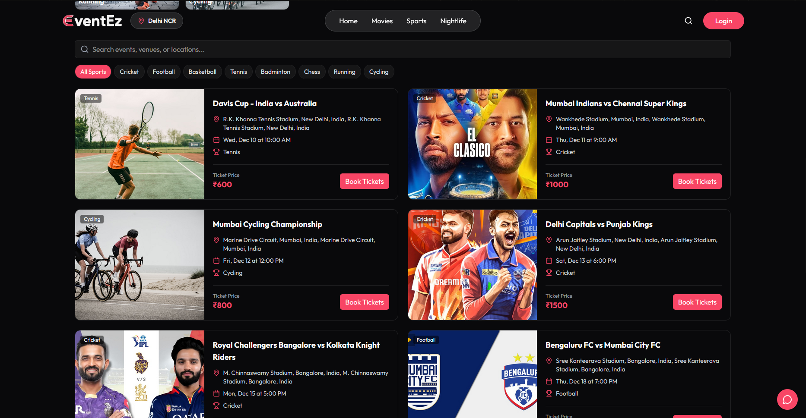 |

| Movies | Cricket Booking |
|:---:|:---:|
| 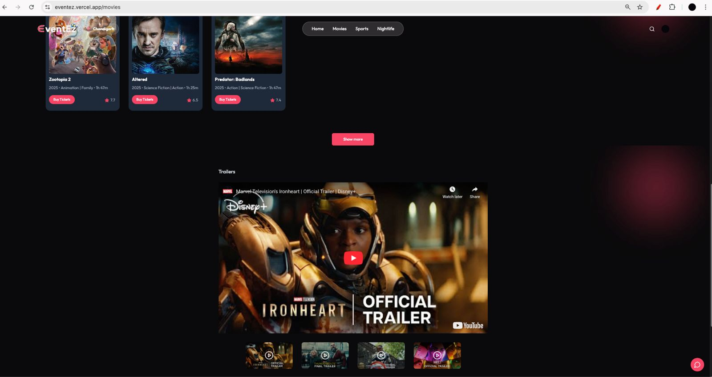 | 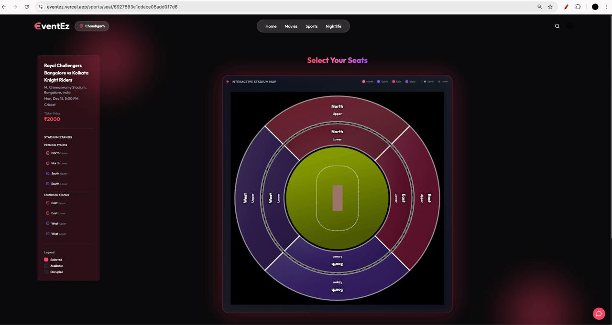 |

---

### 🎫 Booking Flow

| Event Details | Payment |
|:---:|:---:|
| 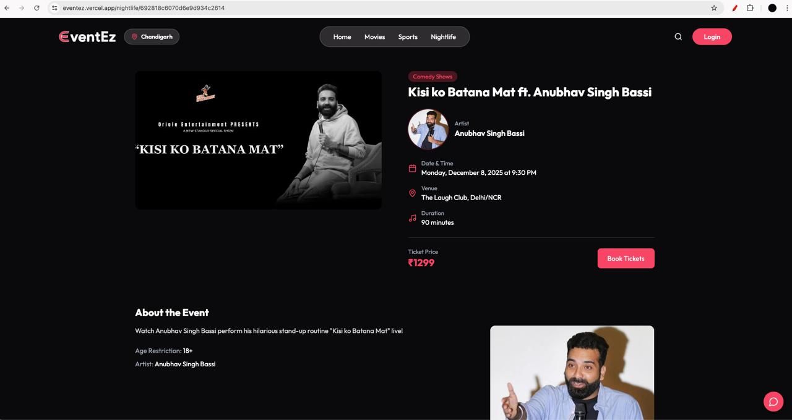 | 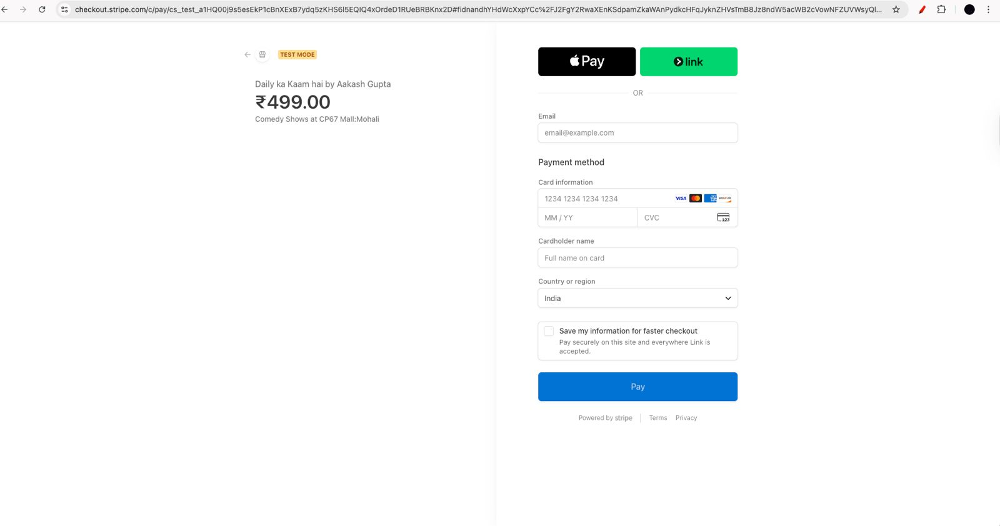 |

| Badminton Court Selection | Location Selector |
|:---:|:---:|
| 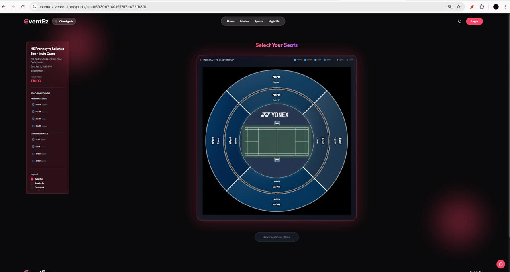 | 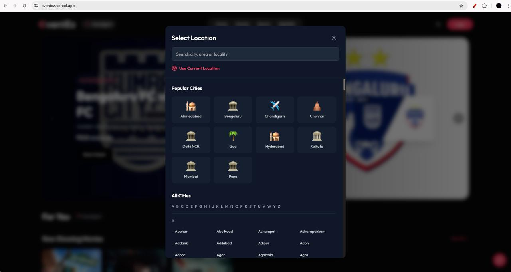 |

---

### 🔍 Search & AI Chatbot

| Search Box | AI Chatbot |
|:---:|:---:|
| 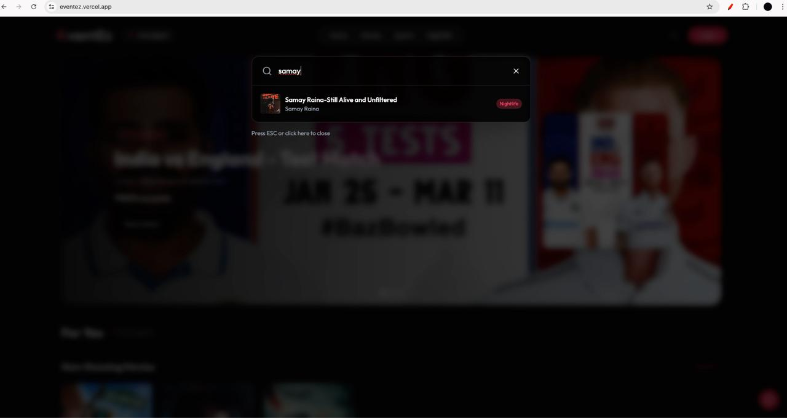 | 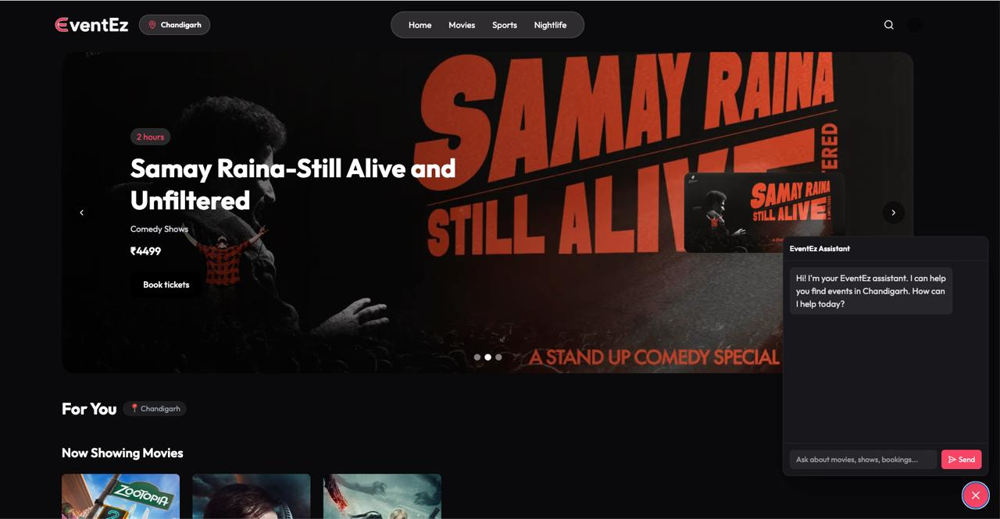 |

</div>

---

## 🛠️ Tech Stack

<div align="center">

### Frontend


### Backend


### Services


</div>

---

## 🚀 Installation

### Prerequisites

Before you begin, ensure you have:
- **Node.js** (v18 or higher)
- **MongoDB** (Atlas or local instance)
- **Clerk Account** (for authentication)

### Quick Start

```bash
# Clone the repository
git clone https://github.com/nishchayy07/EventEz.git
cd EventEz

# Install backend dependencies
cd server
npm install

# Install frontend dependencies
cd ../client
npm install
```

### Environment Setup

Create `.env` files in both `client` and `server` directories:

<details>
<summary>📁 <b>client/.env</b></summary>

```env
VITE_CLERK_PUBLISHABLE_KEY=your_clerk_publishable_key
VITE_API_URL=http://localhost:5000
```
</details>

<details>
<summary>📁 <b>server/.env</b></summary>

```env
MONGO_URI=your_mongodb_connection_string
PORT=5000
CLERK_SECRET_KEY=your_clerk_secret_key
```
</details>

### Run the Application

```bash
# Terminal 1 - Start Backend
cd server
npm start

# Terminal 2 - Start Frontend
cd client
npm run dev
```

🎉 **Open [http://localhost:5173](http://localhost:5173) and you're ready to go!**

---

## 📂 Project Structure

```
EventEz/
├── 📁 client/                 # React Frontend
│   ├── 📁 src/
│   │   ├── 📁 components/     # Reusable UI components
│   │   ├── 📁 pages/          # Page components
│   │   ├── 📁 context/        # React Context
│   │   └── 📁 lib/            # Utility functions
│   └── 📄 package.json
│
├── 📁 server/                 # Express Backend
│   ├── 📁 controllers/        # Route handlers
│   ├── 📁 models/             # MongoDB schemas
│   ├── 📁 routes/             # API routes
│   └── 📄 package.json
│
├── 📁 screenshots/            # App screenshots
└── 📄 README.md
```

---

## 🔮 Future Roadmap

- [ ] 💳 Payment Gateway Integration (Razorpay/Stripe)
- [ ] 📊 User Dashboard with booking analytics
- [ ] 🎛️ Advanced Admin Panel
- [ ] 📧 Email notifications & reminders
- [ ] ⭐ Event reviews & ratings

---

## 🤝 Contributing

Contributions are welcome! Feel free to:

1. Fork the repository
2. Create a feature branch (`git checkout -b feature/AmazingFeature`)
3. Commit changes (`git commit -m 'Add AmazingFeature'`)
4. Push to branch (`git push origin feature/AmazingFeature`)
5. Open a Pull Request

---

## 📄 License

This project is licensed under the **MIT License** — feel free to use it for your own projects!

---

<div align="center">

### ⭐ Star this repo if you found it helpful!


**Made with ❤️ by [Nishchay](https://github.com/nishchayy07)**

</div>
